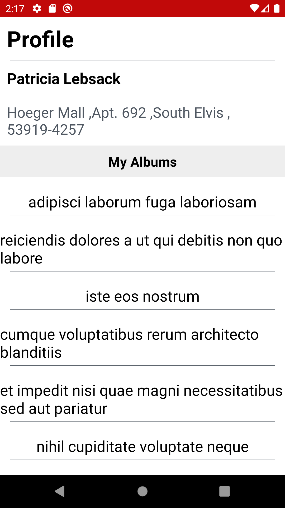
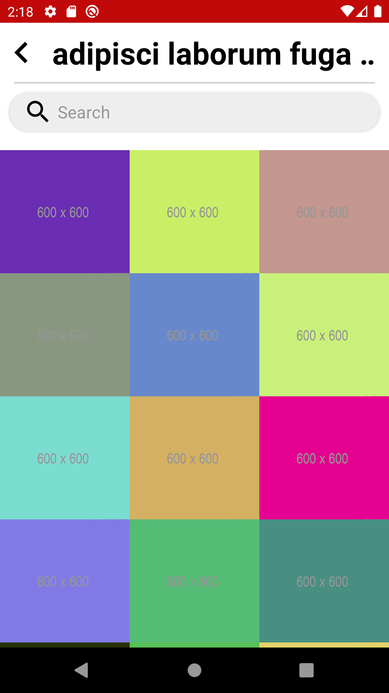

 # Bosta Task
 
 The app is composed of 2 screens, first is the profile screen, it has the user name and address pinned at the top and then it lists all of this user’s albums. You can get user albums by requesting
the albums endpoint and passing user id as a parameter.
When you press on any album it navigates to the second screen which is an album details screen. You request the photos endpoint and pass album id as a parameter, then list the images in an
instagram-like grid. Also there should be a search bar that you can filter within the album by the image title, when you start typing the screen should show only images that are related to this
search query.
 
 Implemented by the dependencies/libraries:
 * Rxjava
 * Kotlin
 * Dagger2
 * MVVM architecture. 
 * Retrofit 2

# Screenshots

   .  
